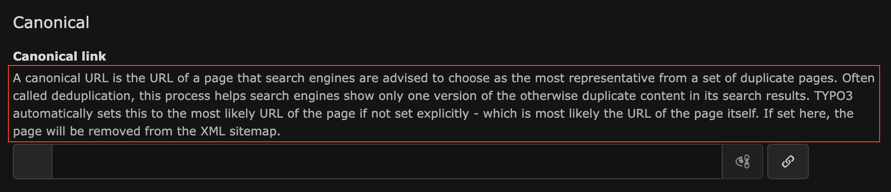

+++
title = "fieldInformation"
naviTitle = "FieldInformation"
date = 2025-05-25T07:00:00+01:00
alwaysopen = false
aliases = ["fieldinformation.html"]
+++

{}TYPO3 8.6{}

Bei `fieldInformation` handelt es sich um den Bereich zwischen Label und dem Form-Element.

