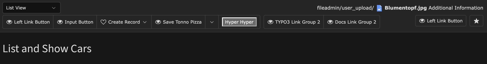

+++
title = "Module Template"
linkTitle = "ModuleTemplate"
date = 2025-08-28T18:34:01+01:00
aliases = ["module-template.html"]
+++

## Einführung in die ModuleTemplate API

{}TYPO3 7.6{}

Mit TYPO3 7.6 wurde die `ModuleTemplate` API eingeführt. Sie ersetzt die bis dahin genutzte `DocumentTemplate`-Klasse, die über viele Jahre hinweg Standard für die Erstellung von Backend-Modulen war.

Da der alte Ansatz mit `DocumentTemplate` noch auf Marker-Templates setzte wurde es Zeit, eine Lösung zu schaffen, die auch mit Fluid klarkam. Die neue `ModuleTemplate` API nutzt das Fluent-API-Design, bei dem die Methodenaufrufe logisch ineinandergreifen und Entwickler von einer besseren IDE-Unterstützung durch Auto-Vervollständigung profitieren.

Ein zentrales Element der neuen API ist das [DocHeader Konzept](doc-header.md), das in mehrere Bereiche unterteilt ist und einigermaßen individuell befüllt werden kann:

* Auswahlmenüs
* Pfadangaben
* Datensatzinformationen inkl. Kontextmenü
* Botton Bar
  * Linke Button-Leiste
  * Rechte Button-Leiste
* Buttons

Dadurch wird die Gestaltung von Backend-Modulen nicht nur konsistenter, sondern auch für Entwickler deutlich einfacher und nachvollziehbarer. Hier ein arg übertriebenes Beispiel, wie der DocHeader Bereich aussehen kann:



## ModuleTemplateFactory

{}TYPO3 12.0{}

[TYPO3 ChangeLog #96730](https://docs.typo3.org/permalink/changelog:feature-96730)

Mit TYPO3 12.0 wurde an der `ModuleTemplate` Klasse ordentlich herumgeschraubt. Diese sollte nicht nur HTML Code erzeugen, sondern ist mit Einführung selbst zur Fluid-Template-View geworden. Bahnbrechend. Kein Hantieren mehr mit der veralteten StandaloneView:

```php
    public function listAction(): ResponseInterface
    {
        $moduleTemplate = $this->moduleTemplateFactory->create($request);
        
        $moduleTemplate->assign('cars', $this->carRepository->findAll());
        
        return $moduleTemplate->renderResponse('Cars/List');
    }
```

Dazu das Fluid-Template:

```html
<html lang="en"
      xmlns:f="http://typo3.org/ns/TYPO3/CMS/Fluid/ViewHelpers"
      data-namespace-typo3-fluid="true">

<f:layout name="Module" />

<f:section name="Before">
    <div>
        Sofern diese f:section existiert wird dieser Inhalt VOR der TYPO3 eigenen Ausgabe ausgegeben.
        Sogar noch VOR dem DocHeader.
        Also Vorsicht, was ihr hier mit macht!
    </div>
</f:section>

<f:section name="Content">
    <h1>Wonderful Cars</h1>
</f:section>

<f:section name="After">
    <div>
        Sofern diese f:section existiert wird dieser Inhalt NACH der TYPO3 eigenen Ausgabe ausgegeben.
    </div>
</f:section>
</html>
```

Das zu ladende Module-Layout steht automatisch zur Verfügung und kann in der `backend` Extension gefunden werden: `vendor/typo3/cms-backend/Resources/Private/Layouts/Module.html`. Achtet darauf, dass die `<f:section>` "Content" mit einem großen `C` lautet. Falsch geschrieben, wird euer Modul-Inhalt nicht ausgegeben.

{}
Im TYPO3 Backend Kontext funktioniert zwar auch die Verwendung von `$this->view->render()`, jedoch ist davon abzuraten, da dieser Aufruf in vielerlei Hinsicht nur für das Frontend gedacht ist und der DocHeader mit den Buttons damit nicht gerendert werden kann. Bitte verwendet die `ModuleTemplateFactory` wie oben beschrieben.
{}

### Module Templates überschreiben

[TYPO3 ChangeLog #96812](https://docs.typo3.org/permalink/changelog:feature-96812)

Der Oberhammer! Alle Backend Module Templates, die auf diese neue API setzen, können mittels PageTSConfig durch eigene Templates ersetzt werden:

```typescript
templates.typo3/cms-backend.1756410278 = stefanfroemken/site-package:Resources/Private/Backend
```

Die Syntax ist aufgeteilt in folgende Bereiche:

* `templates`
* Der Composer Package Name der Extension, deren Template-Pfade überschrieben werden sollen
* Eine einzigartige Zahl. Ich empfehle hier den aktuellen Timestamp zu verwenden
* `=`
* Der Composer Package Name der Extension, deren Templates das Original überschreiben sollen
* Der Pfad zu dem Ordner, worin sich die Ordner `Templates`, `Layouts` und `Partials` befinden

{}
Achtet bitte da drauf den Pfad richtig anzugeben. Eine Pfadangabe direkt in den `Templates` Ordner (Beispiel: `Resources/Private/Backend/Templates`) führt dazu, dass das `ModuleTemplate` die Templates hier erwartet: `Resources/Private/Backend/Templates/Templates/*`.
{}

Der Standard-Pfad für Templates ist: `Resources/Private`. Wenn ihr einen anderen Pfad wünscht, müsst ihr mit dem PageTSConfig von oben den Pfad für Eure eigene Extension umbiegen.

### Zig Methoden bei Einführung schon veraltet

{}TYPO3 12.0{}
{}TYPO3 13.0{}

[TYPO3 ChangeLog #96903](https://docs.typo3.org/permalink/changelog:deprecation-96903)

Leider, oder auch zum Glück, wurden große Teile der `ModuleTemplate` API mit Einführung in der gleichen TYPO3 Version schon wieder deprecated. Vielleicht erinnert sich der eine oder andere an das Chaos mit `->setContent()`:

```php
$moduleTemplate = $this->moduleTemplateFactory->create($request);

$view = GeneralUtility::makeInstance(StandaloneView::class);
$view->setTemplateRootPaths(['EXT:my_extension/Resources/Private/Templates']);
$view->assign('aVariable', 'aValue');

$moduleTemplate->setContent($view->render('MyTemplate'));

return $this->responseFactory->createResponse()
    ->withHeader('Content-Type', 'text/html; charset=utf-8')
    ->withBody($this->streamFactory->createStream($moduleTemplate->renderContent($templateFileName)));
```

Mit diesem Patch wurde `ModuleTemplate` drastisch aufgeräumt. Sämtliche Altlasten, noch aus Zeiten von TYPO3 7, gehören nun der Vergangenheit an.

## ModuleTemplate konfigurieren

### assign

Da das `ModuleTemplate` nun selbst eine View ist, könnt ihr hier, wie von Fluid bekannt, eigene Variablen dem Template hinzufügen.

```php
    public function listAction(): ResponseInterface
    {
        $moduleTemplate = $this->moduleTemplateFactory->create($request);

        $moduleTemplate->assign('cars', $this->carRepository->findAll());
        
        return $moduleTemplate->renderResponse('Cars/List');
    }
```

### assignMultiple

Da das `ModuleTemplate` nun selbst eine View ist, könnt ihr hier, wie von Fluid bekannt auch mehrere Variablen in einem Rutsch dem Template zuweisen.

```php
    public function listAction(): ResponseInterface
    {
        $moduleTemplate = $this->moduleTemplateFactory->create($request);

        $moduleTemplate->assignMultiple([
            'cars' => $this->carRepository->findAll(),
            'contentObject' => $this->request->getAttribute('currentContentObject'),
        ];
        
        return $moduleTemplate->renderResponse('Cars/List');
    }
```

### render

Mit `render` könnt ihr das Fluid-basierte Template verarbeiten und erhaltet den fertigen HTML-Code zurück. Diesen könnt ihr dann entweder weiter verarbeiten, ergänzen, in ein JsonResponse oder HtmlResponse Objekt verpacken.

```php
    public function listAction(): ResponseInterface
    {
        $moduleTemplate = $this->moduleTemplateFactory->create($request);

        return new JsonResponse([
            'content' => $moduleTemplate->render('Cars/List'),
            'status' => 'OK',
        ];
    }
```

### renderResponse

Wie `render`. Hier wird der resultierende HTML-Code für euch bereits automatisch in ein HtmlResponse Objekt verpackt, welches direkt als Rückgabewert für eure Controller-Action verwendet werden kann.

```php
    public function listAction(): ResponseInterface
    {
        $moduleTemplate = $this->moduleTemplateFactory->create($request);

        return $moduleTemplate->renderResponse('Cars/List');
    }
```

### setBodyText

Wer eine zusätzliche CSS-Klasse im `<body>`-Tag wünscht, kann dies mit `setBodyText()` erreichen. Achtung: Die Angabe einer CSS-Klasse wirkt sich auch auf den DocHeader-Bereich mit den Buttons aus. Fluid ViewHelper kann hier nicht verwendet werden.

```php
    public function listAction(): ResponseInterface
    {
        $moduleTemplate = $this->moduleTemplateFactory->create($request);

        $moduleTemplate->setBodyText('<body class="container">');
        
        return $moduleTemplate->renderResponse('Cars/List');
    }
```

### setTitle

Setzen des Seitentitels. Zu sehen im aktuellen Browser-Tab.

```php
    public function listAction(): ResponseInterface
    {
        $moduleTemplate = $this->moduleTemplateFactory->create($request);

        // Second argument is a "context" and can be empty. If context is set, title will result in: "[TITLE] · [CONTEXT]"
        $moduleTemplate->setTitle('My funny cars', 'Look here');
        
        return $moduleTemplate->renderResponse('Cars/List');
    }
```

### getDocHeaderComponent

Hiermit erhaltet ihr Zugriff auf alle benötigten API Aufrufe, um den DocHeader eures Moduls zu individualisieren. Weiteres dazu findet ihr in [DocHeader Component](doc-header.md)

### setForm

Setzt und aktiviert einen eigenen `<form>`-Tag. Um einen schließenden `</form>`-Tag, müsst ihr euch nicht kümmern. Im DocHeader könnt ihr später Buttons vom Typ InputButton hinzufügen. Diese enthalten ein `name`, `value` und auch ein `form` Attribut. Bei Klick wird automatisch das Formular abgeschickt, dessen id-Attribut mit dem form-Attribut übereinstimmt.

{}
In TYPO3 12 gab es noch eine action-save-buttons.js, die sich unter anderem um die InputButtons gekümmert hat. Diese ist in TYPO3 13 zwar noch da, aber als deprecated markiert und wird vonseiten TYPO3 selbst nicht mehr verwendet. Die neue Lösung scheint jedoch [noch nicht die InputButtons zu unterstützen](https://forge.typo3.org/issues/107336). Einzig innerhalb Formulare mit form-engine Unterstützung (TYPO3 List-View-Module) könnten die Buttons wohl überhaupt noch funktionieren.
{}

```php
    public function listAction(): ResponseInterface
    {
        $moduleTemplate = $this->moduleTemplateFactory->create($request);

        $moduleTemplate->setForm(sprintf(
            '<form method="post" action="%s" name="car" id="saveCar">',
            $this->uriBuilder->uriFor('update', null, 'Management'),
        ));
        
        return $moduleTemplate->renderResponse('Cars/List');
    }
```

### setModuleId

Fügt dem ersten `<div>` im Modul ein id-Attribut hinzu. Gerade in Bezug auf JavaScript kann das sinnvoll sein.

```php
    public function listAction(): ResponseInterface
    {
        $moduleTemplate = $this->moduleTemplateFactory->create($request);

        $moduleTemplate->setModuleId('my-special-module-for-cars');
        
        return $moduleTemplate->renderResponse('Cars/List');
    }
```

### setModuleName

Fügt dem ersten `<div>` im Modul ein name-Attribut hinzu. Gerade in Bezug auf JavaScript kann das sinnvoll sein.

```php
    public function listAction(): ResponseInterface
    {
        $moduleTemplate = $this->moduleTemplateFactory->create($request);

        $moduleTemplate->setModuleName('wonderfulCarsModule');
        
        return $moduleTemplate->renderResponse('Cars/List');
    }
```

### setModuleClass

Fügt dem ersten `<div>` im Modul ein class-Attribut hinzu. Gerade in Bezug auf CSS kann das sinnvoll sein.

```php
    public function listAction(): ResponseInterface
    {
        $moduleTemplate = $this->moduleTemplateFactory->create($request);

        $moduleTemplate->setModuleClass('styleMyModule');
        
        return $moduleTemplate->renderResponse('Cars/List');
    }
```

### addFlashMessage

Fügt der FlashMessage Queue von TYPO3 eine neue FlashMessage hinzu, mit der man dem Editor Nachrichten über z. B. einen Speichererfolg mitgeben kann. Die standard FlashMessage Queue kann mit `setFlashMessageQueue` geändert werden.

```php
    public function listAction(): ResponseInterface
    {
        $moduleTemplate = $this->moduleTemplateFactory->create($request);

        $moduleTemplate->addFlashMessage('Hier gibt es jede Pizza', 'Lecker Pizza');
        
        return $moduleTemplate->renderResponse('Cars/List');
    }
```

### setFlashMessageQueue

Standardmäßig wird das `ModulTemplate` mit der TYPO3 Core eigenen FlashMessage Queue initialisiert: `core.template.flashMessages`. Wenn ihr jedoch eure Backendmodule mittels einem Extbase Controller erstellt, lautet der FlashMessage Identifier jedoch: `extbase.flashmessages.[PLUGIN_NAMESPACE]`. FlashMessage, die mit `$this->addFlashMessage()` erstellt werden, werden somit NICHT im Template angezeigt. Darum müsst ihr die Extbase FlashMessage Queue in dem ModuleTemplate zunächst bekannt machen:

```php
    public function listAction(): ResponseInterface
    {
        $moduleTemplate = $this->moduleTemplateFactory->create($request);

        $moduleTemplate->setFlashMessageQueue($this->getFlashMessageQueue());
        
        $this->addFlashMessage('Pizza of type Salami was created.');
        
        return $moduleTemplate->renderResponse('Cars/List');
    }
```

### setUiBlock

Standardmäßig erscheint beim Laden von BE Modulen kurz ein Spinner. Das Modul wird kurz abgedunkelt, damit die Editoren nicht schon irgendwo hinklicken können, obwohl das vollständige JavaScript noch nicht geladen ist, und eben dieser sich drehende Ladebalken (Spinner) erscheint für einen Bruchteil einer Sekunde, bevor das Modul dann freigegeben wird. Dieses Verhalten könnt ihr bei Bedarf auch abschalten:

```php
    public function listAction(): ResponseInterface
    {
        $moduleTemplate = $this->moduleTemplateFactory->create($request);

        $moduleTemplate->setUiBlock(false);
        
        return $moduleTemplate->renderResponse('Cars/List');
    }
```

### makeDocHeaderModuleMenu

Im Rahmen der [DocHeader Components](doc-header.md) kommen wir eh noch zu der Erstellung von Menüs, die durch eine Selectbox realisiert wird. Hier in diesem Fall erleichtert uns das `ModuleTemplate` die Menü-Erstellung erheblich. Wenn euer BE-Modul mehrere Unter-Module hat (wie das "Web" oder auch das "Site Management"-Modul), werden die darunter liegenden Module in diesem Menü automatisch zur Verfügung gestellt. Ausgewählt, landet ihr automatisch im Unter-Modul.

```php
    public function listAction(): ResponseInterface
    {
        $moduleTemplate = $this->moduleTemplateFactory->create($request);

        $moduleTemplate->makeDocHeaderModuleMenu([
            'returnUrl' => (string)$this->coreUriBuilder->buildUriFromRoute('web_cars', [
                'id' => $this->getPageRecord()['uid'],
            ])
        ]);
        
        return $moduleTemplate->renderResponse('Cars/List');
    }

    private function getPageRecord(): array
    {
        $backendUser = $this->getBackendUser();
        $id = (int)($this->request->getQueryParams()['id'] ?? $this->request->getParsedBody()['id'] ?? 0);

        return BackendUtility::readPageAccess($id, $backendUser->getPagePermsClause(Permission::PAGE_SHOW)) ?: [];
    }

    private function getBackendUser(): BackendUserAuthentication
    {
        return $GLOBALS['BE_USER'];
    }
```
